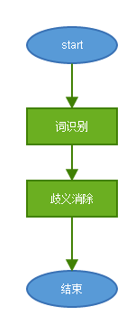
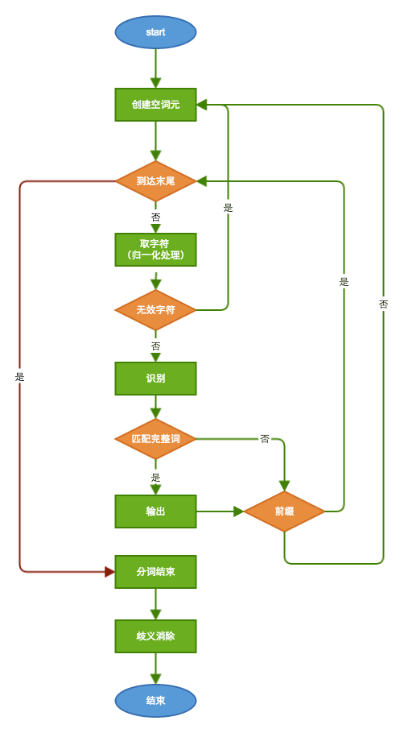
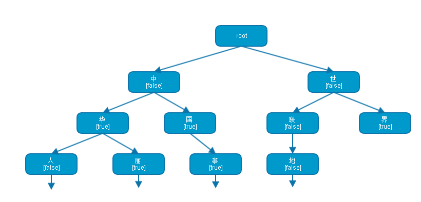
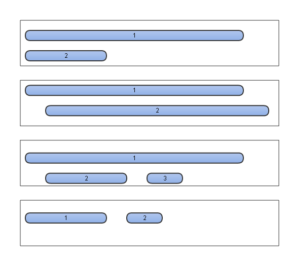
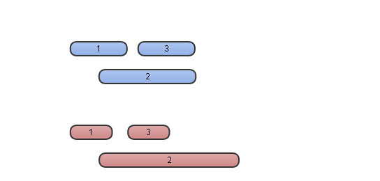
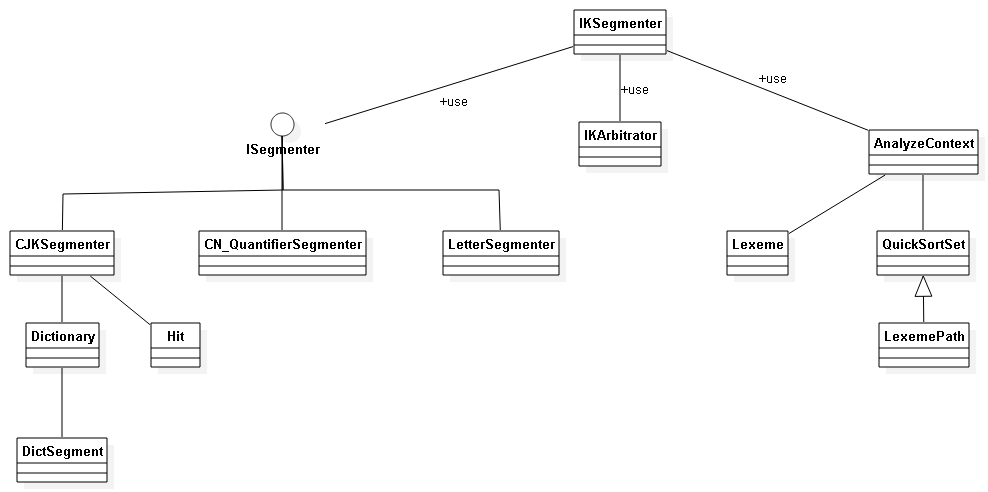

# IKAnalyzer 学习总结

## 名词说明

*	Lexeme(词元)：一个被分解出的完整的单词（在下面论述中为了方便表达，扩展了其不完整的情况，实际中不存在）。
*	AnalyzeContext：分词过程中的上下文信息，非线程安全。
*	LexemePath：词元路径（或者矢量），用于歧义消除。
*	Segmenter：分词器。
*	完整词：一个词库中的词（个人胡乱发明的）。
*	前缀：一个完整词的开头部分。
*	歧义：由于断句的不同，句子可能产生歧义。如“他是中国大学博士”分词存在“他/是/**中国/大学博士**”和“他/是/**中国大学/博士**”的歧义。
*	Arbitrator：决策者，用于寻找存在歧义的LexemePath的最优解。
*	归一化：存入词库和用于分词的字符必须经过归一化（全角转半角，大写转小写）。

## IKAnalyzer的工作流程

### 总流程

Ik总流程分为两部分：

1. 分词（词识别）：逐字符遍历输入的字符流，解析出所有可能的词元。
2. 歧义消除：解决交叉词元的问题，选取最优（或接近）不相交词元的组合作为最终解。

### 分词流程

分词流程是一个迭代的过程，这里的图表述可能不够清楚，下面一步一步介绍：

1. 创建一个空的单字符词元，待用。
2. 取字符：分词过程是一个循环，因此在此之前要判断是否已到达输入字符流的末尾，没有的话则选取第一个字符存入上一步创建的词元中。
3. 是无效字符：中断，所有前缀被当前字符中断。
4. 识别：通过查询预置的词库，判断当前字符是一个完整的单词或是一个完整单词的前一部分（前缀）。
5. 前缀：如果是前缀重复步骤2，读取下一个字符继续判断。如果不是重复步骤1，进行下一字符判断。
6. 完整词：输出当前词到AnalyzeContext。注意是完整词的词元同时可以是前缀（如中华、中华人民），所以要判断（逻辑同步骤5）。
7. 分词结束：如果触及到输入字符流的末尾则表明此次分词结束。
8. 歧义消除：分词结束后，对输出结构做歧义消除处理后才是最终结果。

## IKAnalyzer 源码分析（分词阶段）

这里按照在【工作流程】中的描述步骤，一一描述。

### AnalyzeContext
这个类要提前介绍下，一个Analyzer只有一个AnalyzeContext，对应一个输入流。换句话说Analyzer不是线程安全的，在处理下一个输入流之前必须显式地调用。
AnalyzeContext职责：

* 缓存字符流buffer：默认的AnalyzeContext内置了4096长度的一个char数组用于缓存。
* 保存分词结果：分词过程中输出的词元，全部作为原始分词存储在AnalyzeContext中。
* 支持歧义消除：AnalyzeContext还肩负了部分歧义消除的任务——维护歧义消除的中间结果，保存最终输出结果。
* 协调各分词器（Segmenter）：IKAnalyzer默认适配三个分词器：英文单词、数量词、中文（中日韩），在补充缓存时AnalyzeContext要找到三者就认可的分割点，否则就有可能某个分词器正在分的词被人截断了。

AnalyzeContext内的变量：

	class AnalyzeContext {
		//默认缓冲区大小
		private static final int BUFF_SIZE = 4096;
		//缓冲区耗尽的临界值
		private static final int BUFF_EXHAUST_CRITICAL = 100;	
		
	 
		//字符窜读取缓冲
	    private char[] segmentBuff;
	    //字符类型数组
	    private int[] charTypes;
	    
	    
	    //记录Reader内已分析的字串总长度
	    //在分多段分析词元时，该变量累计当前的segmentBuff相对于reader起始位置的位移
		private int buffOffset;	
	    //当前缓冲区位置指针
	    private int cursor;
	    //最近一次读入的,可处理的字串长度
		private int available;
	
		
		//子分词器锁
	    //该集合非空，说明有子分词器在占用segmentBuff
	    private Set<String> buffLocker;
	    
	    //原始分词结果集合，未经歧义处理
	    private QuickSortSet orgLexemes;    
	    //LexemePath位置索引表
	    private Map<Integer , LexemePath> pathMap;    
	    //最终分词结果集
	    private LinkedList<Lexeme> results;
	    
		//分词器配置项
		private Configuration cfg;
	
	...
	}

* segmentBuff、charTypes字符流缓存，前者缓存字符，后者缓存字符类型。
* orgLexemes 原始词元的保存
* pathMap 辅助歧义消除
* results 最终分词结果
* bufferLocker 分词器协调，用于锁定该Context。

### 取字符

取字符是移动AnalyzeContext的指针实现的，会涉及到两个问题字符的归一化和何时补充AnalyzeContext中的charBuffer。

#### 归一化

AnalyzeContext提供moveCursor()方法向下移动一位，移动的同时会归一化当前字符、判断当前字符类型（无效、量词、字母、阿拉伯数字、汉子），具体实现可以参看CharacterUtil的代码。

#### 补充charBuffer

首先必须明确补充charBuffer带来的副作用，补充charBuffer就是把当前buffer中未处理的字符移到数组前面并从字符流中读取新的数据补充后面的空闲位置。该动作将引发AnalyzeContext中offset、cursor位置变化，已经识别的词元（只保存了begin、offset和length）将丢失内容；正在识别的字符（当前为前缀）将被中断。

**已经识别词元**：

调用addLexeme()方法，输出到AnalyzeContext的orgSegments中。

**正在识别词元**：

阻止补充charBuffer的动作，也就是AnalyzeContext的协同功能:

1. AnalyzeContext设立了临界值（100），在charBuffer小于临界值时开始尝试补充buffer。
2. 分词器Segmenter发现自己识别到前缀时，调用lockBuffer()锁定当前AnalyzeContext，锁定动作导致AnalyzeContext不能补充buffer。
3. 只有所有分词器都释放锁以后，才能执行补充动作。

### 识别

识别是指查询当前字符串是前缀、完整词，或者都不是，在分词过程中AnalyzeContext每向前移动一个字符，都要识别当前字符。

识别的功能交由分词器实现，IKAnalyzer中包括三个分词器：

1. org.wltea.analyzer.core.LetterSegmenter：英文字母和单词识别。
2. org.wltea.analyzer.core.CN_QuantifierSegmenter：中文数量词子分词器。
3. org.wltea.analyzer.core.CJKSegmenter：中文-日韩文子分词器。

以下是ISegmenter.next()的代码（context.fillBuffer 补充buffer；segmenter.analyze 子分词器分词；context.moveCursor() 指针移动；context.needRefillBuffer() 判断可否补充<到达临界值且没有锁定>）：

	/**
	 * 分词，获取下一个词元
	 * @return Lexeme 词元对象
	 * @throws IOException
	 */
	public synchronized Lexeme next()throws IOException{
		Lexeme l = null;
		while((l = context.getNextLexeme()) == null ){
			/*
			 * 从reader中读取数据，填充buffer
			 * 如果reader是分次读入buffer的，那么buffer要  进行移位处理
			 * 移位处理上次读入的但未处理的数据
			 */
			int available = context.fillBuffer(this.input);
			if(available <= 0){
				//reader已经读完
				context.reset();
				return null;
				
			}else{
				//初始化指针
				context.initCursor();
				do{
        			//遍历子分词器
        			for(ISegmenter segmenter : segmenters){
        				segmenter.analyze(context);
        			}
        			//字符缓冲区接近读完，需要读入新的字符
        			if(context.needRefillBuffer()){
        				break;
        			}
   				//向前移动指针
				}while(context.moveCursor());
				//重置子分词器，为下轮循环进行初始化
				for(ISegmenter segmenter : segmenters){
					segmenter.reset();
				}
			}
			//对分词进行歧义处理
			this.arbitrator.process(context, this.cfg.useSmart());			
			//将分词结果输出到结果集，并处理未切分的单个CJK字符
			context.outputToResult();
			//记录本次分词的缓冲区位移
			context.markBufferOffset();			
		}
		return l;
	}

**前两个分词器相对简单，这里只重点介绍第三个。**

#### CJKSegmenter
先来看一个复杂的分词用例“中华人民共和国”，这个词在分词过程中会产生多个完整词和前缀：

* 中： **前缀**[中]
* 华： **前缀**[中华，华]；**完整词**[中华]
* 人： **前缀**[中华人，人]；**完整词**[中华，华人]
* 民： **前缀**[中华人民， 人民]；**完整词**[中华，华人，中华人民，人民]
* 共： **前缀**[中华人民共，人民共，共]；**完整词**[中华，华人，中华人民，人民]
* 和： **前缀**[中华人民共和，人民共和，共和]；**完整词**[中华，华人，中华人民，人民，共和]
* 国： **前缀**[]；**完整词**[中华，华人，中华人民，人民，中华人民共和国，人民共和国，共和国]

结论：一段字符串既可以是前缀又可以是完整词；任何一个字符都可能是新的前缀。

CJKSegmenter正是根据这个“结论”来的：

1. 维护了LinkedList tmpHits保存每个可能的前缀，使用LinkedList也说明了这里每个元素有随时被干掉的风险。
2. 读入新字符，对tmpHits每个元素加上当前字符判断。是完整词输出到AnalyzeContext，是前缀继续下一轮，都不是移除。
3. 判断新字符是否是前缀，如果是加入tmpHits。
4. tmpHits不为空，锁定AnalyzeContext；否则，解锁。
5. 重复步骤2。

##### 前缀和完整词识别

IKAnalyzer的分词依赖词库，简单讲CJKSegment的识别就是拿着拼好的字符串去词库里查询是否存在这个词，或者存在以这段字符开始的词，关键在于字典的组织。

IKAnalyzer中使用多叉树储存词库，识别逻辑共涉及三个类：

* Hit：描述命中情况，并保存最后一个DictSegment的指针，用于下次快速进入。
* Dictionary：词库。
* DictSegment：多叉树节点的封装。包含当前字符、下一级节点、是否是完整词的status。

上图展现了一个词库示意图。

1. root根节点是虚构的。
2. 左一节点“中”是一个DictSegment的实例，false指明其不是一个完整词，但是有“华”、“国”两个儿子节点，所以它是前缀。
3. “华”既是一个完整词，又是前缀。
4. “界”是完整词，但不是前缀。

### 分词结束

当字符流读到结尾时，分词结束。此时清理所有为前缀而不能构成完整词的数据，并进入歧义消除阶段。

## IKAnalyzer 源码分析（歧义消除阶段）

这部分主要有三个类负责：QuickSortSet、LexemePath、Arbitrator，其次还涉及到Lexeme内的compareTo方法。

### QuickSortSet

QuickSortSet用于AnalyzeContext中存储原始词元。

	private QuickSortSet orgLexemes;    

其中的数据有两个特点：

1. 去重，重复词元在此过滤掉了。
2. 有序。

QuickSortSet中词元存储顺序由Lexeme的compareTo方法决定：

	public int compareTo(Lexeme other) {
		//起始位置优先
        if(this.begin < other.getBegin()){
            return -1;
        }else if(this.begin == other.getBegin()){
        	//词元长度优先
        	if(this.length > other.getLength()){
        		return -1;
        	}else if(this.length == other.getLength()){
        		return 0;
        	}else {//this.length < other.getLength()
        		return 1;
        	}
        	
        }else{//this.begin > other.getBegin()
        	return 1;
        }
	}

1. 起始位置靠前词元排在前面。
2. 词元长度越长词元位置越靠前。

所以在QuickSortSet中，元素的排布情况包括以下几种。

QuickSortSet的介绍暂时到此，在后面会继续涉及这部分。

### Arbitrator

Arbitrator处理歧义分两步进行：划分冲突范围和选择最优解。

#### 范围划分

可见在QuickSortSet中除了第四种情况是天然不存在歧义的，其它三种都需要处理。那么歧义处理的范围应该如何划定——范围越小，所消费的资源越少，处理难度越小。

所以在歧义处理过程中第一步要进行的就是划分歧义处理范围，IK的做法是按照QuickSortSet中的顺序遍历原始词元，每当找到一个与之前所有词元不相交的词元时此位置之前便是一个最小歧义处理范围。

#### 歧义处理

歧义处理的方法是在最小歧义范围内对所有词元进行排列组合，选取不相交的组合；再根据一定的判断标准判定出最优的组合即为最终解。

简言之Arbitrator干的事情就是划分，排列，再划分，在排列…… 如何划分和排列需要使用LexemePath。

### LexemePath

LexemePath继承自QuickSortSet，顾名思义它是一组词元（Lexeme）的路径。

先介绍LexemePath中关键的几个变量：

* begin：路径起始位置，即所有词元中最靠前的位置。
* end：路径结束位置，即所有词元中最靠后的位置。
* payloadLength：路径有效负载，所有词元有效长度的累加值。

再来关注该类中三个方法：

* boolean addCrossLexeme()，只添加交叉词元，如果该词元与路径中其它词元无交叉，返回false。
* boolean addNotCrossLexeme()，只添加非交叉词元，如果该词元与路径中任意词元交叉，返回false。
* int compareTo()，比较。这个要直接看源码：

		public int compareTo(LexemePath o) {
			//比较有效文本长度
			if(this.payloadLength > o.payloadLength){
				return -1;
			}else if(this.payloadLength < o.payloadLength){
				return 1;
			}else{
				//比较词元个数，越少越好
				if(this.size() < o.size()){
					return -1;
				}else if (this.size() > o.size()){
					return 1;
				}else{
					//路径跨度越大越好
					if(this.getPathLength() >  o.getPathLength()){
						return -1;
					}else if(this.getPathLength() <  o.getPathLength()){
						return 1;
					}else {
						//根据统计学结论，逆向切分概率高于正向切分，因此位置越靠后的优先
						if(this.pathEnd > o.pathEnd){
							return -1;
						}else if(pathEnd < o.pathEnd){
							return 1;
						}else{
							//词长越平均越好
							if(this.getXWeight() > o.getXWeight()){
								return -1;
							}else if(this.getXWeight() < o.getXWeight()){
								return 1;
							}else {
								//词元位置权重比较
								if(this.getPWeight() > o.getPWeight()){
									return -1;
								}else if(this.getPWeight() < o.getPWeight()){
									return 1;
								}
								
							}
						}
					}
				}
			}
			return 0;
		}

这就是选择最优解的选取原则： 有效文档长度越长越好 > 词元个数越少越好 > 路径跨越长度越长越好 > 位置越靠后越好 > 词长越平均越好(各词元长度乘机) > 词元位置权重（词元位置pos * 词元长度的累加和）越大越好。

### 流程说明

最后，结合代码再次说明Arbitrator的工作方式：

#### 歧义范围划分（代码截取自Arbitrator）

		LexemePath crossPath = new LexemePath();
		while(orgLexeme != null){
			if(!crossPath.addCrossLexeme(orgLexeme)){
				//找到与crossPath不相交的下一个crossPath	
				if(crossPath.size() == 1 || !useSmart){
					//crossPath没有歧义 或者 不做歧义处理
					//直接输出当前crossPath
					context.addLexemePath(crossPath);
				}else{
					//对当前的crossPath进行歧义处理
					QuickSortSet.Cell headCell = crossPath.getHead();
					LexemePath judgeResult = this.judge(headCell, crossPath.getPathLength());
					//输出歧义处理结果judgeResult
					context.addLexemePath(judgeResult);
				}
				
				//把orgLexeme加入新的crossPath中
				crossPath = new LexemePath();
				crossPath.addCrossLexeme(orgLexeme);
			}
			orgLexeme = orgLexemes.pollFirst();
		}

1. 新建LexemePath，开始遍历orgSegments。
2. if条件不成立时（当前词元与路径相交），继续下一条。
3. 直到if条件成立，crossPath.size() == 1 || !useSmart（词元个数为1，或者不使用userSmart模式）直接输出，否则切分调用this.judge()方法做歧义消除。
4. 构建新的LexemePath，重复步骤1。

#### 歧义消除（代码截取自Arbitrator）

	private LexemePath judge(QuickSortSet.Cell lexemeCell , int fullTextLength){
		//候选路径集合
		TreeSet<LexemePath> pathOptions = new TreeSet<LexemePath>();
		//候选结果路径
		LexemePath option = new LexemePath();
		
		//对crossPath进行一次遍历,同时返回本次遍历中有冲突的Lexeme栈
		Stack<QuickSortSet.Cell> lexemeStack = this.forwardPath(lexemeCell , option);
		
		//当前词元链并非最理想的，加入候选路径集合
		pathOptions.add(option.copy());
		
		//存在歧义词，处理
		QuickSortSet.Cell c = null;
		while(!lexemeStack.isEmpty()){
			c = lexemeStack.pop();
			//回滚词元链
			this.backPath(c.getLexeme() , option);
			//从歧义词位置开始，递归，生成可选方案
			this.forwardPath(c , option);
			pathOptions.add(option.copy());
		}
		
		//返回集合中的最优方案
		return pathOptions.first();

	}

judge()的代码分两部分看，第一部分while()循环之前。

	/**
	 * 向前遍历，添加词元，构造一个无歧义词元组合
	 * @param LexemePath path
	 * @return
	 */
	private Stack<QuickSortSet.Cell> forwardPath(QuickSortSet.Cell lexemeCell , LexemePath option){
		//发生冲突的Lexeme栈
		Stack<QuickSortSet.Cell> conflictStack = new Stack<QuickSortSet.Cell>();
		QuickSortSet.Cell c = lexemeCell;
		//迭代遍历Lexeme链表
		while(c != null && c.getLexeme() != null){
			if(!option.addNotCrossLexeme(c.getLexeme())){
				//词元交叉，添加失败则加入lexemeStack栈
				conflictStack.push(c);
			}
			c = c.getNext();
		}
		return conflictStack;
	}

调用forward()，构造了首个可能解并把它加入到有序TreeSet<LexemePath> pathOptions中。与此同时，产生了与该解冲突的所有词元的堆栈（顺序是QuickSortSet的逆向）。

第二部分遍历冲突词元，试图从中间找出更多可能解。

	private void backPath(Lexeme l  , LexemePath option){
		while(option.checkCross(l)){
			option.removeTail();
		}	
	}
1. 在当前解中移除最后一个词元。
2. 以当前冲突词元为起点向前遍历，试图找到下一个解。
3. 添加可能解到TreeSet中。
4. 重复步骤1直到遍历结束。
5. 由于TreeSet是有序的，在结束遍历之后，TreeSet中首个元素便是找到的最优解。

参考如下图片，IKAnalyzer并没有进行全量的排列组合，这种处理方式可以解决【蓝色】表示的冲突问题，但是在【红色】表示的情境下，IK会错过最优解。其作者说明的IK正确率是95%，这种查找最优解的方式也许是性能和正确率之间权衡的结果？

## 类图

